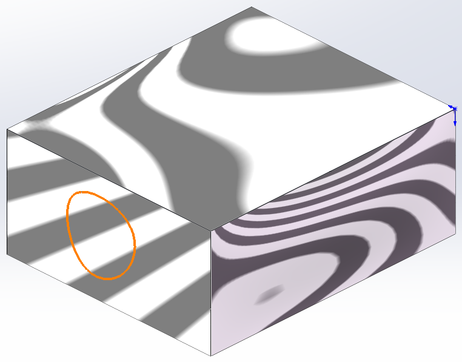
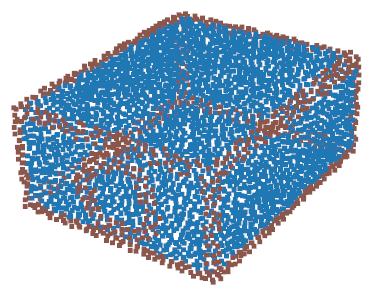
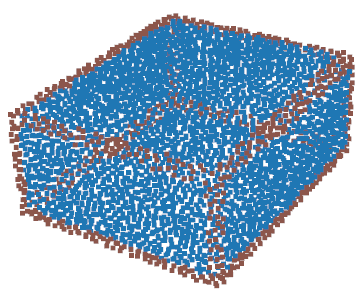

## pythonocc-core 环境搭建
### 1. 创建 conda 环境  
`conda create -n occt python=3.9.19`  
`conda activate occt`

### 2. 安装 pythonocc-core
`conda install -c conda-forge pythonocc-core=7.7.2`  

无法安装`pythonocc-core`需要添加下载源：  
`conda config --add channels https://mirrors.tuna.tsinghua.edu.cn/anaconda/pkgs/free/`  
`conda config --add channels https://mirrors.tuna.tsinghua.edu.cn/anaconda/pkgs/main/`  
`conda config --add channels https://mirrors.tuna.tsinghua.edu.cn/anaconda/pkgs/pro/`  
`conda config --add channels https://mirrors.tuna.tsinghua.edu.cn/anaconda/cloud/pytorch/`  
`conda config --add channels https://mirrors.tuna.tsinghua.edu.cn/anaconda/cloud/conda-forge/`  
`conda config --set show_channel_urls yes`

### 3. 安装其它包：  
`pip install open3d`  
`pip install pymeshlab`  
`pip install tqdm`  
`pip install matplotlib`

## 使用方法
STEP处理脚本：step_proc.py
Mesh处理脚本：mesh_proc.py
点云、STEP、Mesh可视化脚本：vis.py

## 更新日志
### 2024.6.23 优化边缘处理方法，相切过渡面不会被视为边缘

目标模型的平面内包含子面  

优化前获得的点云：  

优化后获得的点云：  

